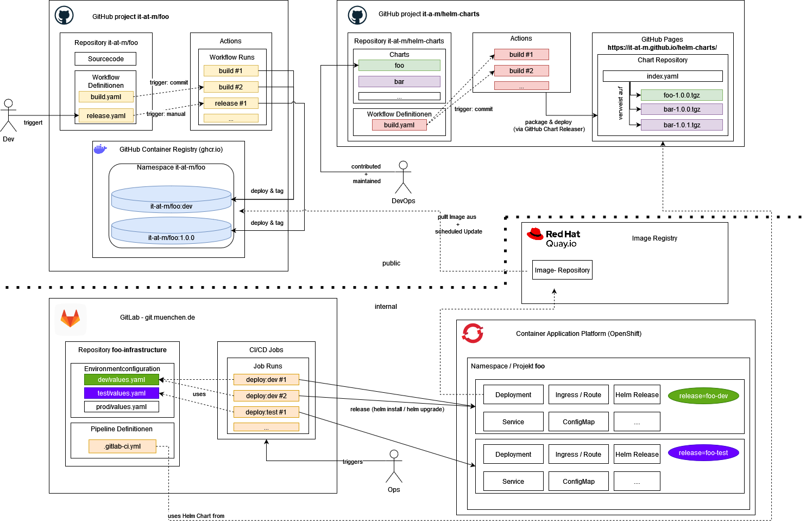
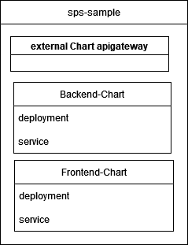

# Deployment Overview

\_The diagram shows an overview of the steps for delivering our applications, from code changes to deployment in our environment:

1. _GitHub Project `it-at-m/foo`_: Add code changes, compile and build code, build images
2. _GitHub Project `it-at-m/helm-charts`_: Provide helm charts for project images
3. _Image Registry `Quai.io`_: Internal image registry, synchronized with our project images
4. _GitLab `git.muenchen.de`_: Internal Git repository to run deployment pipelines
5. _OpenShift `Container Application Platform`_: Internal kubernetes plattform to run applications

You can find further details in the following chapters.\_

# Source repository (GitHub Project `it-at-m/foo`)

Execute GitHub Actions to compile and build code, build images. For more information see [workflows.md](./workflows.md).

# Helm Chart (GitHub Project `it-at-m/helm-charts`)

In the repository [it-at-m/helm-charts](https://github.com/it-at-m/helm-charts) we provide helm charts for Docker images created in our project repos. There you can find the sample helm chart [sps-sample](https://github.com/it-at-m/helm-charts/tree/main/charts/sps-sample), which consists of subcharts. Each subchart is a different module, for example frontend, backend, eai. Each module was created with `helm create` and we made some adaptions. The Chart.yml includes the external dependency of the [RefArch API Gateway Helm Chart](https://github.com/it-at-m/helm-charts/tree/main/charts/refarch-gateway). The main config is done in the values.yml of the parent chart. In the sections refarch-gateway, frontend, backend you can configure the subcharts.

# Internal Deployment (Image Repository `Quai`, Git Repository GitLab `git.muenchen.de`, Kubernetes platform `OpenShift`)

## What are we using internally

- Image Registry [Red Hat Quay](https://docs.redhat.com/de/documentation/red_hat_quay) for synchronising docker images
- [Gitlab](https://docs.gitlab.com/) for the execution of internal pipelines (IaC) and configuration of the applications
- [Openshift](https://docs.redhat.com/en/documentation/openshift_container_platform) for the operations of the applications

## How it works together

### Autorollout: For the dev environment (only not prductive enviornment)

An automatic rollout is implemented. We create an image stream that links to internal Image Registry (Quay). The deployment includes a special annotation that prompts The internal kubernetes platform (Openshift) to automatically trigger a new rollout when a new image becomes available. For more details, see [this documentation](https://docs.redhat.com/en/documentation/openshift_container_platform/4.17/html/images/triggering-updates-on-imagestream-changes#triggering-updates-on-imagestream-changes).

### manual rollout for the deployment in productive and close to productive environments

For the other environment (test, prod), a manual rollout is implemented. You have to specify the image version for each service in the values.yml as well paying attention to use the image from the internal image registry and not from the GitHub Registry.
